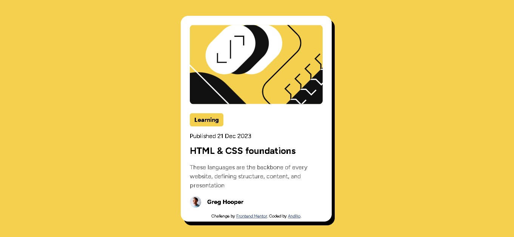

# Frontend Mentor - QR code component solution

This is a solution to the [Blog preview card challenge on Frontend Mentor](https://www.frontendmentor.io/challenges/blog-preview-card-ckPaj01IcS). Frontend Mentor challenges help you improve your coding skills by building realistic projects.  

## Table of contents

- [Overview](#overview)
  - [Screenshot](#screenshot)
  - [Links](#links)
- [My process](#my-process)
  - [Built with](#built-with)
  - [What I learned](#what-i-learned)
  - [Useful resources](#useful-resources)
- [Author](#author)

**Note: Delete this note and update the table of contents based on what sections you keep.**

## Overview

### Screenshot

### Links

- Solution URL: [Solution](https://github.com/NdokiA/Frontend-Mentor-Blog-Card)
- Live Site URL: [Live Site](https://NdokiA.github.io/Frontend-Mentor-Blog-Card)

## My process

### Built with

- Semantic HTML5 markup
- CSS custom properties
- Flexbox

### What I learned

During this project, I reinforced my understanding of HTML and CSS basics. Specifically, I learned how to:

- Structure a webpage using semantic HTML5 elements.
- Apply CSS custom properties to maintain consistent styling across the project.
- Utilize Flexbox to create responsive layouts and align items effectively.

### Useful resources

- [edsHTML](https://www.youtube.com/watch?v=PHaMGTwnL0A) - This helped me understand the code

## Author

- Website - [@NdokiA](https://github.com/NdokiA)
